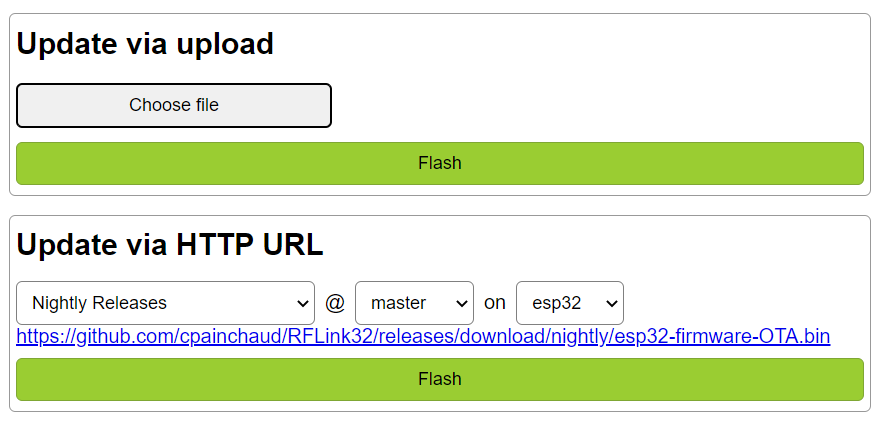

# RFLink ESP

This is a Radio Frequency to MQTT/Serial/TCP gateway built for ESP32 and ESP8266 boards (see #MCU for more).

It receives and decodes OOK 433MHz signals from your sensors, alarms and pushes them over MQTT/TCP/Serial.
For some devices it can also send commands to control them.

This project is forked from RFLink-ESP (for ESP8266), which itself is forked from the original RFlink project "Release 29" for Arduino.

This fork provides additional features:

- Fully (almost) configurable from a web interface whilst retaining the CLI.
- No recompilation for most options which are configurable at runtime and saved in Flash.
- More advanced debugging and troubleshooting helpers.
- Restructured source code with namespaces and classes (Work in Progress)

## 1. MCU

We extensively use ESP32 dev kits.
This is the default settings in `Platformio.ini` and `RFLink.h` files.

You may also use other ESP8266/ESP8255 based boards, when there are no pin limitations. NodeMCUv2 is known to work.

## 2. Receiver / Transmitter / Transceiver

As a starting point, you can use the RXB6 receiver which is a simple and stable 3.3v component - it is easy to find and cheap.
Many other receivers are also supported.

> **Avoid using generic noname receivers!**

For more advanced behavior and reliability, the following receivers are also supported when used with an ESP32 board:

- SX1278
- SX1276
- RFM69CW
- RFM69HCW
- CC1101

These advanced receivers require a few pins to be connected to the host.
The recommended pin assignments are:

|  Name         | ESP32 | SX1278/6 | RFM69(H)CW | CC1101 |
|---------------|-------|----------|------------|--------|
|               |  3v3  |   VCC    |  3.3V      | VCC    |
|               |  GND  |   GND    |  GND       | GND    |
|               |  18   |   SCK    |  SCK       | SCK    |
|               |  19   |   MISO   |  MISO      | MISO   |
|               |  23   |   MOSI   |  MOSI      | MOSI   |
| pins::RX_RESET|  4¹   |  NRESET  |  RESET     |        |
| pins::RX_CS   |  5¹   |   NSS    |  NSS       | CSN    |
| pins::RX_DATA pins::TX_DATA |  26¹  |   DIO2   |  DIO2      | GDO0   |

¹ *These must be configured in the web portal, values suggested here are proven to work reliably.*

## 3. OLED display

You can use an OLED display.
We used a SSD1306 128x64 I2C screen in our tests.

**This is highly experimental** and therefore not enabled by default.

## 4. IDE

We strongly recommend using the [PlatformIO IDE](https://platformio.org/install) however, you may alternatively use the [Arduino IDE 1.8.10](https://www.arduino.cc/en/Guide/HomePage).

## 5. Framework

We use [Arduino Core for ESP8266](https://github.com/esp8266/Arduino).

## 6. Libraries

In addition to the core libraries, the following are also in use:

- PubSubClient for MQTT messaging https://github.com/knolleary/pubsubclient
- u8g2/u8x8 library for OLED display https://github.com/olikraus/u8g2

## 7. Compile Options and Flags

Many features are not enabled by default or can be disabled for various reasons like firmware size or compatibility.

### OTA *(disabled by default)*

There are 3 types of OTA to update your firmware:

#### Arduino/ESP's classic push over UDP *(disabled by default)*

- `RFLINK_OTA_ENABLED` we recommend that you enable a password for this method or anyone on your network could push a new firmware to the device.
- `RFLINK_OTA_PASSWORD="my_password_here"` or `RFLINK_OTA_PASSWORD='"'${sysenv.OTA_SEC}'"'` in `platformio.ini` with an environment variable called `OTA_SEC`

#### AutoOTA

The device will download new firmware from a specified URL.

- RFLINK_AUTOOTA_ENABLED
- AutoOTA_URL in `Credentials.h` or in `platformio.ini`

#### Config Portal Web Upload

A firmware file can be uploaded via the Config Portal's Firmware page.

## 8. Additional Info

### Config Portal

#### Repository

The Config Portal web ui is located in its [own repository](https://github.com/cpainchaud/rflink-webui).

#### Default Login Details

rflink32 / 433mhz

### Pinout

- Pin setup has to be done via the Config Portal when it is active.
- For safety and simplicity all pins are inactive by default.
- Decoupling capacitors and antenna can be added to improve results.

Simple RX pin wiring:

|  Name         | D1 mini | RXB6  |
|---------------|---------|-------|
| PIN_RF_TX_VCC |   D5    | 5 VCC |
| PIN_RF_TX_NA  |   D6    | 6 DER |
| PIN_RF_TX_DATA|   D7    | 7 DAT |
| PIN_RF_TX_GND |   D8    | 8 GND |

### Alternative Pinout

- ESP8266 can't draw more than 12mA on a GPIO pin.
- Some receivers have current spikes bigger than that (eg RXB12).
- This leads to a non working receiver or non starting ESP.

Safe alternative wiring:

|  Name         | D1 mini | RXB6  |
|---------------|---------|-------|
| PIN_RF_TX_VCC |   3v3   | 5 VCC |
| PIN_RF_TX_NA  |   N/A   | 6 DER |
| PIN_RF_TX_DATA|   D7    | 7 DAT |
| PIN_RF_TX_GND |   GND   | 8 GND |

### Thanks

Special thanks to: Axellum, Etimou, Schmurtz, Zoomx
